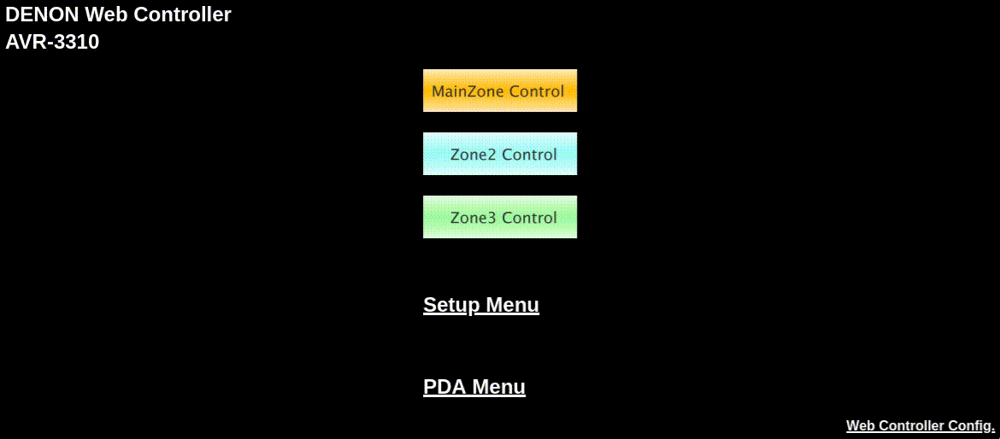
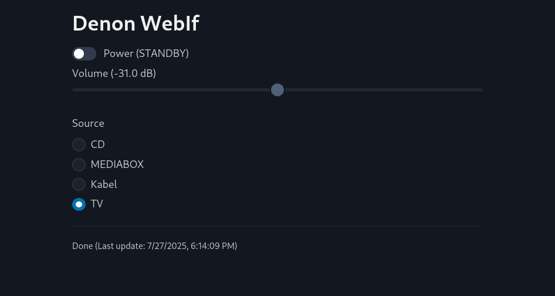

# Denon WebIf

The web interface of my Denon 3310 is pretty slow and putting a Pi Zero W as a RJ45-to-Wifi adapter in front of it sure
didn't help.

Most of the time is spent delivering the assets, but the endpoints for getting and altering the device's state are very fast.
So I wrote a minimal interface using those endpoints only. It's a single HTML file with [some CSS from pico](https://picocss.com/) statically hosted,
but it needs nginx in front to bypass the CORS by using it as a reverse proxy.

Setup is extremely ease though.

This is what it looks like:

## Usage

* `docker build -t denon_webif:latest .`
* `docker run -p 8080:80 -e DENON_HOST=192.168.1.2 denon_webif:latest`